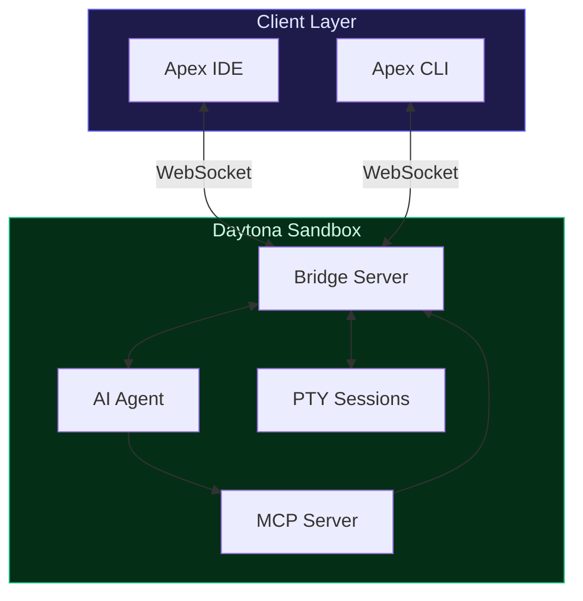

<p align="center">
  <h1 align="center">Daytona Apex</h1>
  <p align="center">Run AI coding agents in secure cloud sandboxes — from your terminal or a full web IDE</p>
</p>

<p align="center">
  <a href="#apex-cli">CLI</a> &middot;
  <a href="#apex-ide">IDE</a> &middot;
  <a href="#architecture">Architecture</a> &middot;
  <a href="#getting-started">Getting Started</a> &middot;
  <a href="#development-guide">Development Guide</a> &middot;
  <a href="#project-structure">Project Structure</a> &middot;
  <a href="#tech-stack">Tech Stack</a>
</p>

---

**Apex** runs AI coding agents — Claude Code, Codex, and more — inside secure [Daytona](https://www.daytona.io/) cloud sandboxes. This repository contains two applications that share the same sandboxing infrastructure:

### Apex CLI

A terminal tool that wraps coding agents running inside sandboxes. The agent executes remotely in an isolated environment, but the experience feels like it's running on your local machine — you interact through your existing terminal workflow, and Apex handles provisioning, connection, and session management transparently.

### Apex IDE

A web-based development environment for interactively building applications with coding agents. It provides a full IDE experience — file explorer, terminals, source control, search — all running against a secure sandbox, with the agent's work streaming back to you in real time.

## Architecture



### How It Works

Both the CLI and IDE follow the same core flow — provision a sandbox, connect to the agent, stream results:

1. **Create a project** — optionally link a Git repository to clone into the sandbox.
2. **Sandbox provisioned** — a Daytona sandbox spins up from a snapshot with the AI agent pre-installed. A Node.js bridge is uploaded and started inside it.
3. **Start a chat** — send a prompt. The bridge spawns the agent process, pipes structured JSON output back over WebSocket.
4. **Stream in real time** — every tool call, code edit, and thought from the agent streams back live. Multiple chats can run concurrently in the same sandbox.
5. **Interactive terminals** — open terminals alongside the agent. The agent itself can create terminals via MCP tools (e.g., to start a dev server).
6. **Session continuity** — follow-up prompts resume the agent's session.

The **CLI** connects directly to the sandbox bridge via WebSocket — no API server needed. The **IDE** routes through the API server, which manages projects, persists state, and relays the connection.

## Apex CLI

A CLI binary that makes remote sandboxed agents feel local. See the full [CLI documentation](apps/cli/README.md) for all commands, flags, and usage examples.

- **Transparent wrapping** — run Claude Code, Codex, or other agents inside Daytona sandboxes while interacting through your terminal as if the agent were local
- **Direct connection** — connects straight to the sandbox bridge via WebSocket, no API server in the middle
- **Project management** — `create`, `open`, `project list`, `project delete`
- **Session persistence** — follow-up prompts carry full conversation context; `cmd` resumes existing chats
- **REPL-style chat** — rich terminal rendering of agent output (thoughts, tool calls, code edits)
- **Automatic provisioning** — sandbox creation, bridge setup, and Git repo cloning happen behind the scenes
- **Ephemeral sandboxes** — `apex run "prompt"` spins up a throwaway sandbox, runs the task, and tears it down
- **Scriptable** — `run` and `cmd` output only the result by default, making them safe to pipe

## Apex IDE

An Electron (or web-based) development environment for building applications interactively with AI agents.

- **Full IDE experience** — VS Code–inspired layout with resizable panels, file explorer, search, and Git source control
- **Live agent chat** — send prompts and watch the agent work in real time with grouped message rendering
- **Integrated terminals** — multiple terminal tabs with full PTY support (xterm.js); the agent can also create its own terminals via MCP tools
- **Multiple concurrent chats** — run several agent sessions in the same sandbox, each with its own context
- **Command palette** — every action is a registered command with customizable keyboard shortcuts
- **Session continuity** — layout state, chat history, and agent sessions persist across reloads and devices

## Shared Infrastructure

Both applications are built on top of the same sandboxing layer:

- **Daytona SDK** for sandbox lifecycle management (create, start, stop, destroy)
- **WebSocket bridge** protocol — a Node.js server inside each sandbox that spawns agents, manages PTY sessions, and streams structured output
- **MCP Terminal Server** — gives agents the ability to open, read, write to, and close terminals
- **WebSocket** for real-time communication between clients and sandboxes
- **SQLite** database for projects, chats, and messages (IDE path)

## Getting Started

Download the latest release from the [Releases](https://github.com/daytonaio/apex/releases) page.

### Apex CLI

Download the binary for your platform and add it to your `PATH`:

```bash
apex --help
```

### Apex IDE

Download the Electron app for your platform (macOS, Linux, or Windows) and launch it.

Alternatively, the IDE can be accessed as a web app — see the [Development Guide](#development-guide) for running it locally.

### Configuration

Both the CLI and IDE require a [Daytona](https://www.daytona.io/) account and an API key for your coding agent:

- **Daytona API key** — get one from [app.daytona.io](https://app.daytona.io) → Settings → API Keys
- **Agent API key** — Anthropic for Claude Code, OpenAI for Codex, etc.

## Development Guide

### Prerequisites

- **Node.js** >= 18
- **npm** >= 9
- **Go** >= 1.21 (for the CLI)
- A [Daytona](https://www.daytona.io/) account with API access
- An API key for your coding agent (Anthropic for Claude Code, OpenAI for Codex, etc.)

### Installation

```bash
git clone https://github.com/daytonaio/apex.git
cd apex
npm install
```

### Environment Variables

Create a `.env` file in the project root:

```env
DAYTONA_API_KEY=your-daytona-api-key
DAYTONA_SERVER_URL=https://your-daytona-instance.com
DAYTONA_TARGET=your-target
ANTHROPIC_API_KEY=sk-ant-...
```

### Running the IDE

```bash
# Start both API server and dashboard in dev mode
npm run serve

# Or start them individually
npm run serve:api        # API on http://localhost:6000
npm run serve:dashboard  # Dashboard on http://localhost:4200
```

### Building the CLI

```bash
cd apps/cli
./scripts/build.sh              # all platforms → bin/
./scripts/build.sh darwin-arm64 # single target
./bin/apex-darwin-arm64 --help
```

## Project Structure

```
apex/
├── apps/
│   ├── api/              # IDE backend — NestJS (REST + WebSocket)
│   ├── dashboard/        # IDE frontend — React (Vite + Tailwind CSS 4 + Zustand)
│   └── cli/              # Apex CLI — Go (Cobra + Gorilla WebSocket)
├── libs/
│   ├── orchestrator/     # Shared sandbox management, bridge scripts, types
│   └── shared/           # Shared TypeScript types
├── workdocs/             # Internal architecture documentation
├── keybindings.json      # User-editable keyboard shortcuts (IDE)
└── package.json          # Nx monorepo root
```

| Package | Description |
|---|---|
| `apps/api` | IDE backend — REST API, WebSocket gateway, sandbox orchestration, SQLite database |
| `apps/dashboard` | IDE frontend — chat UI, terminal panel, file explorer, source control, command palette |
| `apps/cli` | Apex CLI — wraps remote agents for a local terminal experience, direct sandbox connection ([README](apps/cli/README.md)) |
| `libs/orchestrator` | Sandbox lifecycle (Daytona SDK), bridge script generation, WebSocket protocol types |
| `libs/shared` | TypeScript types shared between API and dashboard |

## Tech Stack

| Layer | Technology |
|---|---|
| **IDE Frontend** | React 19, Vite 7, Tailwind CSS 4, Zustand, xterm.js, Lucide Icons |
| **IDE Backend** | NestJS 11, TypeORM, SQLite (better-sqlite3), WebSocket |
| **CLI** | Go, Cobra, Gorilla WebSocket, Daytona Go SDK |
| **Sandbox** | Daytona, Node.js bridge, node-pty, MCP Terminal Server |
| **Build** | Nx monorepo, Webpack (API), Vite (Dashboard), Go toolchain (CLI) |

## License

This software is source-available under a custom license that permits free personal, non-commercial use. Commercial use and redistribution are not permitted. See [LICENSE](LICENSE) for details.
