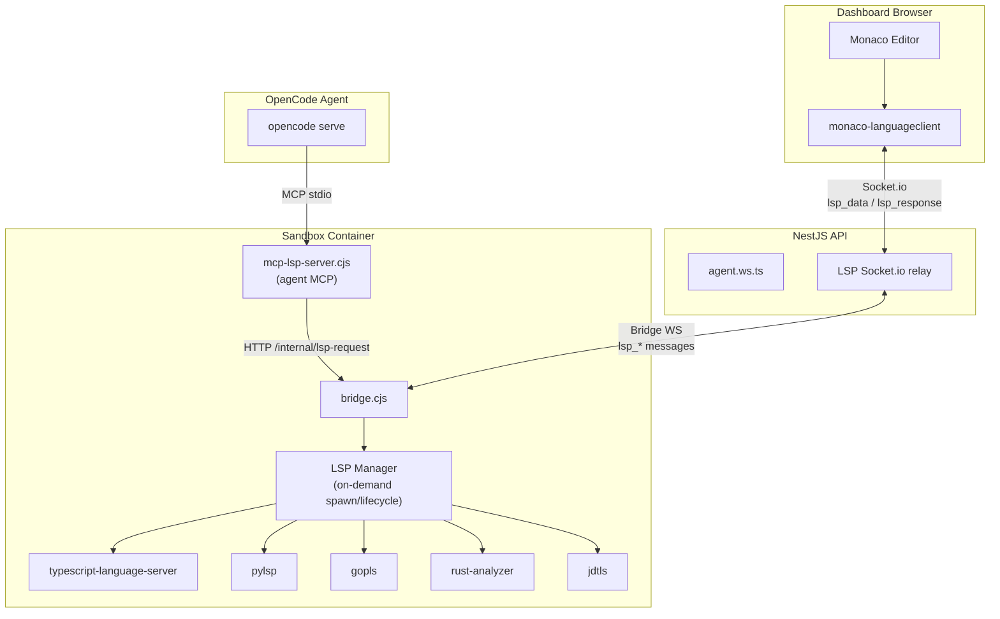

# LSP Integration

> Language Server Protocol support for both the dashboard code editor (via `monaco-languageclient`) and the AI agent (via MCP LSP server), with LSP servers managed by the bridge process inside sandboxes.

---

## Architecture



---

## File Map

| Layer | File | Purpose |
|---|---|---|
| **Bridge** | `libs/orchestrator/src/lib/bridge-script.ts` | LSP process manager: on-demand spawn, initialize handshake, stdio forwarding, status lifecycle, WebSocket message routing, HTTP `/internal/lsp-request` endpoint |
| **Bridge types** | `libs/orchestrator/src/lib/types.ts` | `BridgeLspData`, `BridgeLspResponse`, `BridgeLspStatus` message types |
| **MCP server** | `libs/orchestrator/src/lib/mcp-lsp-script.ts` | Agent-facing MCP tools: `lsp_hover`, `lsp_definition`, `lsp_references`, `lsp_diagnostics`, `lsp_completions`, `lsp_symbols` |
| **NestJS relay** | `apps/api/src/modules/agent/agent.ws.ts` | Relays `lsp_data`/`lsp_response`/`lsp_status` between dashboard Socket.io and bridge WebSocket |
| **Dashboard editor** | `apps/dashboard/src/components/editor/code-viewer.tsx` | `MonacoEditorReactComp` with LSP config, context menu, action execution, reveal-line |
| **Dashboard context menu** | `apps/dashboard/src/components/editor/editor-context-menu.tsx` | DOM-based right-click menu (web); desktop uses Electrobun native `ContextMenu` |
| **Dashboard LSP request** | `apps/dashboard/src/components/editor/lsp-request.ts` | One-shot LSP request utility for Find All References/Implementations |
| **Dashboard transport** | `apps/dashboard/src/components/editor/lsp-transport.ts` | Custom `MessageTransport` bridging Socket.io events to JSON-RPC + client-side LSP readiness detection |
| **Dashboard context** | `apps/dashboard/src/components/editor/lsp-context.tsx` | React context + sandbox file system overlay registration |
| **Dashboard sandbox FS** | `apps/dashboard/src/components/editor/sandbox-fs-provider.ts` | VS Code file system overlay fetching sandbox files on demand via Socket.io |
| **Dashboard references** | `apps/dashboard/src/components/editor/references-panel.tsx` | Sidebar panel for Find All References/Implementations results |
| **Dashboard store** | `apps/dashboard/src/stores/lsp-store.ts` | Zustand store for per-language LSP status |
| **Dashboard refs store** | `apps/dashboard/src/stores/references-store.ts` | Zustand store for Find All results |
| **Dashboard hook** | `apps/dashboard/src/hooks/use-lsp-socket.ts` | Socket.io hook for LSP data/status events |
| **Sandbox manager** | `libs/orchestrator/src/lib/sandbox-manager.ts` | Uploads `mcp-lsp-server.cjs`, registers in `opencode.json` |
| **Dockerfile** | `images/default/Dockerfile` | Installs all 5 LSP servers (typescript-language-server, pylsp, gopls, rust-analyzer, jdtls) |

---

## Supported Languages

| Language | LSP Server | Command | Notes |
|---|---|---|---|
| TypeScript / JavaScript | `typescript-language-server` | `typescript-language-server --stdio` | npm global install |
| Python | `python-lsp-server` | `pylsp` | pip install |
| Go | `gopls` | `gopls` | `go install` |
| Rust | `rust-analyzer` | `rust-analyzer` | via `rustup component add` |
| Java | Eclipse JDT LS | `jdtls` | `/opt/jdtls` with ~1GB heap, lazy-start only |

---

## Bridge LSP Manager

The LSP manager in `bridge-script.ts`:

- Maintains a map of running LSP server processes keyed by language ID
- **On-demand activation**: servers are NOT started at bridge boot; they spawn lazily on the first request (critical for Java's ~1GB heap)
- Sends `initialize` LSP request with the correct `rootUri` (project directory)
- Emits `lsp_status` messages over the bridge WebSocket:
  - `{ type: "lsp_status", language: "typescript", status: "starting" }` — server spawn initiated
  - `{ type: "lsp_status", language: "typescript", status: "ready" }` — initialize handshake complete
  - `{ type: "lsp_status", language: "typescript", status: "error", error: "..." }` — failed to start
  - `{ type: "lsp_status", language: "typescript", status: "stopped" }` — server exited
- Handles restart-on-crash and cleanup on disconnect

### Two Interfaces

1. **Streaming** (dashboard): WebSocket `lsp_data` (inbound JSON-RPC from dashboard) and `lsp_response` (outbound JSON-RPC to dashboard), with a `language` field for routing
2. **Request/response** (agent MCP): `POST /internal/lsp-request` — sends a single LSP request (method + params), returns the response synchronously

---

## MCP LSP Server (Agent)

`mcp-lsp-script.ts` exposes high-level LSP operations as MCP tools:

| MCP Tool | Description |
|---|---|
| `lsp_hover` | Get hover info at file:line:col |
| `lsp_definition` | Go to definition |
| `lsp_references` | Find all references |
| `lsp_diagnostics` | Get diagnostics for a file |
| `lsp_completions` | Get completions at position |
| `lsp_symbols` | List document or workspace symbols |

Each tool calls `POST /internal/lsp-request` on the bridge. The MCP server itself is stateless. Registered in `opencode.json` alongside the terminal MCP server.

---

## Dashboard Editor Migration

The editor was migrated from `@monaco-editor/react@4.7.0` (vanilla Monaco) to `@typefox/monaco-editor-react@7.7.0` + `monaco-languageclient@10.7.0` (VS Code services + LSP).

### Key Dependencies

| Package | Purpose |
|---|---|
| `@typefox/monaco-editor-react` | React wrapper for Monaco with VS Code services |
| `monaco-languageclient` | LSP client infrastructure + 34 `@codingame/monaco-vscode-*` service packages |
| `@codingame/monaco-vscode-rollup-vsix-plugin` | Vite plugin for serving VS Code extension files (themes) |
| `@codingame/esbuild-import-meta-url-plugin` | esbuild plugin for `import.meta.url` resolution in workers |

### Vite Config Changes

```typescript
import vsixPlugin from '@codingame/monaco-vscode-rollup-vsix-plugin';
import importMetaUrlPlugin from '@codingame/esbuild-import-meta-url-plugin';

// Added to plugins:
plugins: [react(), tailwindcss(), vsixPlugin()],

// Added top-level:
optimizeDeps: {
  esbuildOptions: { plugins: [importMetaUrlPlugin] },
},
worker: { format: 'es' },
```

### Component API Changes

| Old (`@monaco-editor/react`) | New (`@typefox/monaco-editor-react`) |
|---|---|
| `<Editor>` / `<DiffEditor>` JSX | `<MonacoEditorReactComp>` with config objects |
| `onMount` callback | `onEditorStartDone` callback |
| `beforeMount` callback | `onVscodeApiInitDone` callback |
| `language` prop | `codeResources.modified.enforceLanguageId` |
| `value` / `defaultValue` | `codeResources.modified.text` |
| `path` prop | `codeResources.modified.uri` |
| `monaco.editor.defineTheme()` | `userConfiguration.json` with `workbench.colorTheme` |

### Theme Migration

Custom `IStandaloneThemeData` themes registered via `monaco.editor.defineTheme()` were replaced with VS Code's `userConfiguration` JSON. The built-in "Default Dark Modern" theme is used. Custom themes can be configured via `editor.tokenColorCustomizations` and `workbench.colorCustomizations` in the userConfiguration JSON string.

### Bundle Size Impact

| Metric | Old (vanilla Monaco) | New (with LSP) |
|---|---|---|
| Total JS (raw) | ~3 MB | ~12 MB |
| Total JS (gzipped) | ~1 MB | ~3 MB |

The increase comes from VS Code service infrastructure and bundled language packs. Can be trimmed by importing only specific `@codingame/monaco-vscode-*` packages instead of the umbrella `monaco-languageclient`.

---

## Socket Protocol

All LSP events use the shared `/ws/agent` Socket.io namespace.

| Event | Direction | Payload | Description |
|---|---|---|---|
| `lsp_data` | client→server | `{ language, jsonrpc }` | Raw JSON-RPC message to send to the LSP server for a language |
| `lsp_response` | server→client | `{ language, jsonrpc }` | Raw JSON-RPC message from the LSP server |
| `lsp_status` | server→client | `{ language, status, error? }` | LSP server lifecycle status (starting/ready/error/stopped) |

The NestJS gateway relays these between the dashboard Socket.io connection and the bridge WebSocket.

---

## Bridge Protocol Types

```typescript
interface BridgeLspData {
  type: 'lsp_data';
  language: string;
  jsonrpc: object;
}

interface BridgeLspResponse {
  type: 'lsp_response';
  language: string;
  jsonrpc: object;
}

interface BridgeLspStatus {
  type: 'lsp_status';
  language: string;
  status: 'starting' | 'ready' | 'error' | 'stopped';
  error?: string;
}
```
